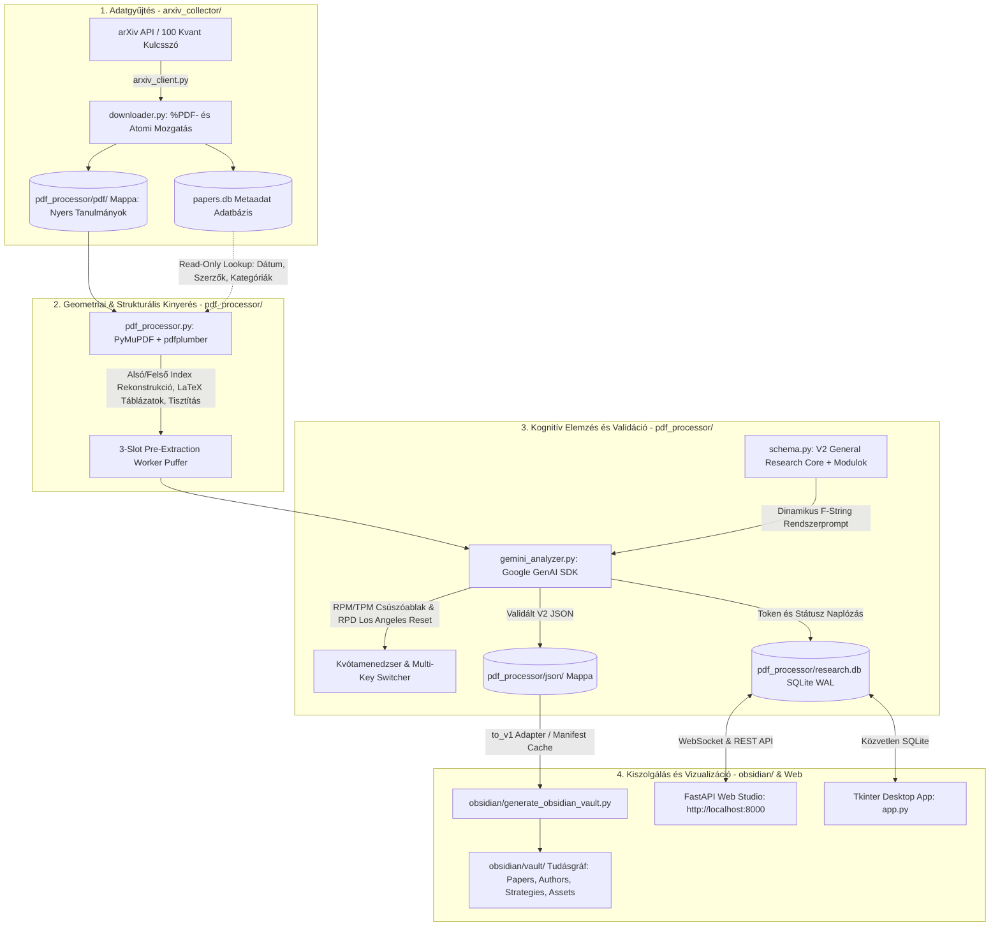
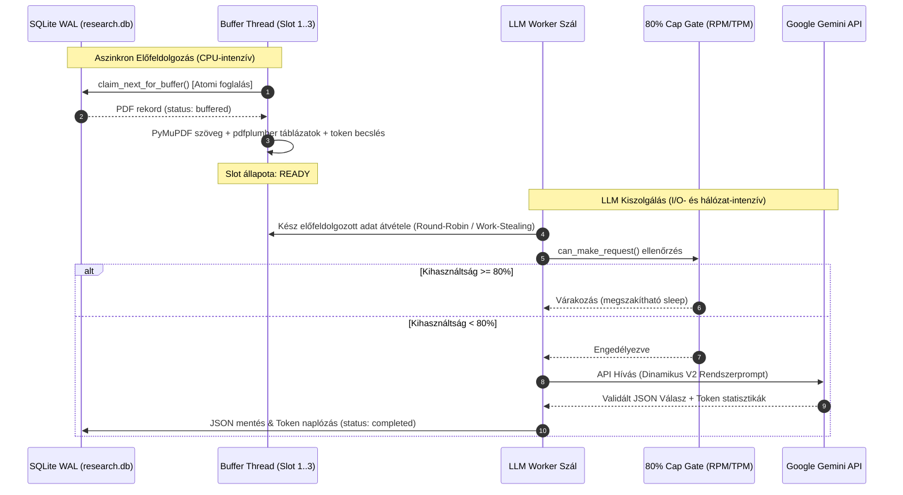

# FinMind — Quant Research AI Platform & Knowledge Graph (V2)

Összetett, nagy megbízhatóságú és professzionális kutatási platform **kvantitatív pénzügyi, matematikai, statisztikai és algoritmikus kereskedési (quantitative finance & systematic trading)** tudományos publikációk automatizált gyűjtésére, geometriai és szemantikai kinyerésére, mesterséges intelligenciával történő mélyelemzésére, strukturált relációs adatbázisba rendezésére és interaktív **Obsidian Knowledge Graph** tudáshálóvá alakítására.

---

## Tartalomjegyzék

1. [Rendszeráttekintés](#1-rendszeráttekintés)
2. [A Két Fő Rendszerfejlesztés és Audit (V2 Upgrade)](#2-a-két-fő-rendszerfejlesztés-és-audit-v2-upgrade)
   - [2.1. Első Javítás: PDFProcessor v2 (Geometriai & arXiv-Tekintélyű Kinyerés)](#21-első-javítás-pdfprocessor-v2-geometriai--arxiv-tekintélyű-kinyerés)
   - [2.2. Második Javítás: Kutatási Séma v2.0 & Gemini AI Rendszer (General Research Core + Present-Gated Modulok)](#22-második-javítás-kutatási-séma-v20--gemini-ai-rendszer-general-research-core--present-gated-modulok)
3. [Projekt- és Könyvtárstruktúra (A 3 Alrendszer)](#3-projekt--és-könyvtárstruktúra-a-3-alrendszer)
4. [Különálló Programok és Alrendszerek Részletes Katalógusa](#4-különálló-programok-és-alrendszerek-részletes-katalógusa)
   - [4.1. ArXiv PDF Gyűjtő Alrendszer (`arxiv_collector/`)](#41-arxiv-pdf-gyűjtő-alrendszer-arxiv_collector)
   - [4.2. Kettős Motoros Geometriai PDF Kinyerő (`pdf_processor/pdf_processor.py`)](#42-kettős-motoros-geometriai-pdf-kinyerő-pdf_processorpdf_processorpy)
   - [4.3. Google Gemini AI Elemző és Kvótamenedzser (`pdf_processor/gemini_analyzer.py`)](#43-google-gemini-ai-elemző-és-kvótamenedzser-pdf_processorgemini_analyzerpy)
   - [4.4. Strukturált Kutatási Séma és Adapter (`pdf_processor/schema.py`)](#44-strukturált-kutatási-séma-és-adapter-pdf_processorschemapy)
   - [4.5. SQLite WAL Adatbázis Motor és Könyvtár (`pdf_processor/database.py`, `research.db`)](#45-sqlite-wal-adatbázis-motor-és-könyvtár-pdf_processordatabasepy-researchdb)
   - [4.6. Valós Idejű FastAPI Web Studio (`pdf_processor/web_app.py`, `web/`, `run_processor.bat`)](#46-valós-idejű-fastapi-web-studio-pdf_processorweb_apppy-web-run_processorbat)
   - [4.7. Asztali Tkinter Grafikus Felület (`pdf_processor/app.py`)](#47-asztali-tkinter-grafikus-felület-pdf_processorapppy)
   - [4.8. Determinisztikus Obsidian Brain Gráfgenerátor (`obsidian/generate_obsidian_vault.py`, `generate_obsidian.bat`)](#48-determinisztikus-obsidian-brain-gráfgenerátor-obsidiangenerate_obsidian_vaultpy-generate_obsidianbat)
   - [4.9. Karbantartó és Diagnosztikai Eszközök (`pdf_processor/check_db.py`)](#49-karbantartó-és-diagnosztikai-eszközök-pdf_processorcheck_dbpy)
   - [4.10. Nagy Sebességű 3D GPU Tudásgráf Stúdió (`graph_3d/`, `run_3d_graph.bat`)](#410-nagy-sebességű-3d-gpu-tudásgráf-stúdió-graph_3d-run_3d_graphbat)
5. [Mély Architektúra: Többszálúság, 3-Slot Puffer és Sebességkorlátozás](#5-mély-architektúra-többszálúság-3-slot-puffer-és-sebességkorlátozás)
6. [Konfigurációs Referencia (`config.json`)](#6-konfigurációs-referencia-configjson)
7. [Telepítés és Rendszerkövetelmények](#7-telepítés-és-rendszerkövetelmények)
8. [Végponttól Végpontig Munkafolyamat (End-to-End Workflow)](#8-végponttól-végpontig-munkafolyamat-end-to-end-workflow)
9. [Hibaelhárítási Útmutató (Troubleshooting)](#9-hibaelhárítási-útmutató-troubleshooting)

---

## 1. Rendszeráttekintés

A platform egy ipari szintű, robusztus és aszinkron pipeline-t valósít meg, amely az internetről letöltött nyers tudományos PDF cikkekből tiszta, matematikai pontosságú és kereshető relációs tudásbázist, valamint kétirányú hivatkozásokkal ellátott vizuális tudáshálót (Knowledge Graph) épít:



### A rendszer legfontosabb képességei:
1. **Intelligens arXiv szüretelés (`arxiv_collector/`)**: 100 szigorúan szelektált kvantitatív pénzügyi témakörben kutat, deduplikál és streamelt letöltéssel `%PDF-` integritás-ellenőrzést végez a `pdf_processor/pdf/` mappába.
2. **Korszerű geometriai PDF kinyerés (`pdf_processor/pdf_processor.py` v2)**: Alsó- és felsőindexek rekonstrukciója betűméret- és origó-eltérésekből ($dW_{t}$, $10^{4}$), keret nélküli LaTeX táblázatok felderítése felirathorgonyzással, ismétlődő fejlécek/láblécek zónaszűrése, ligatúrabontás és arXiv API metaadat-egyeztetés.
3. **General Research Core V2 séma (`pdf_processor/schema.py` & `gemini_analyzer.py`)**: Megszünteti a nem-kereskedési tanulmányok kényszerített stratégiává hallucinálását. Elsőrangú állampolgárrá emeli a tételeket, képleteket, feltevéseket, adatfelhasználást, tudományos metrikákat (RMSE, $R^2$, AIC) és a 9 kísérlettípust.
4. **Present-Gated moduláris architektúra**: Kereskedési stratégiák (`strategy`), portfóliókezelés (`portfolio`), árjegyzés (`market_making`), derivatívák (`derivatives`), kockázatkezelés (`risk`), gépi tanulás (`machine_learning`) és mikroszerkezet (`microstructure`) kizárólag szigorú bizonyítékkapu (Strategy Gate) megléte esetén kerül kitöltésre.
5. **Multi-Key és hivatalos Los Angeles-i éjféli kvótaszinkron**: Párhuzamos Gemini API kulcsok automatikus rotálása a legtöbb szabad RPD alapján, US/Pacific éjféli nullázódás kiszámításával, percenkénti RPM/TPM 80%-os biztonsági lefékező kapuval.
6. **3-Slot aszinkron előfeldolgozó puffer**: Megszünteti a CPU-intenzív PDF kinyerés és a hálózati LLM várakozás egymásra torlódását.
7. **Determinisztikus, inkrementális Obsidian Brain Graph generátor (`obsidian/`)**: LLM nélküli, 0.1 másodperces inkrementális generálás `.vault_manifest.json` gyorsítótárral az `obsidian/vault/` mappába, megőrizve a felhasználó saját kézi jegyzeteit.
8. **3 Kényelmi Fő Indítófájl a gyökérben**: `run_collector.bat`, `run_processor.bat`, `generate_obsidian.bat`.

---

## 2. A Két Fő Rendszerfejlesztés és Audit (V2 Upgrade)

A rendszer két lépcsőben esett át auditon és teljes körű refaktoráláson, amely a kinyerési és az értelmezési rétegek korábbi minőségi korlátait orvosolta.

### 2.1. Első Javítás: PDFProcessor v2 (Geometriai & arXiv-Tekintélyű Kinyerés)

#### Az elvégzett audit tapasztalatai (V1 hiányosságok):
- **Matematikai egyenletek korrupciója**: Az egyszerű szövegfolyamban az indexek egybeolvadtak ($dW_t \rightarrow dWt$, $10^4 \rightarrow 104$), a több sorra tört egyenletek szétcsúsztak ($E[S_t^2] \rightarrow E[S2\newline t]$), a kalapok és integrálok téves karakterekké alakultak.
- **Táblázatok működésképtelensége**: A klasszikus vonal-alapú táblázatkereső a határvonal nélküli LaTeX táblázatokat nem észlelte (pl. a *TradeR* tanulmány 9 valódi táblázatából 0-t talált meg), miközben az ábrák szövegtöredékeit tévesen 20–40 soros hamis táblázatoknak jelölte meg.
- **Hibás publikációs dátumok és téves besorolás**: A tanulmányok 25,2%-ában az LLM a PDF szövegből rossz évet következtetett ki (gyakran az arXiv újragenerálási dátumát, pl. `D:2024...` egy 2007-es papírnál), holott a hiteles API metaadat elérhető volt a helyi adatbázisban.

#### A `pdf_processor.py` implementált fejlesztései:
1. **Betűgeometriai alsó/felső index rekonstrukció**:
   - A PyMuPDF `get_text("dict")` span-szintű koordinátáiból és betűméreteiből a rendszer automatikusan észleli a bázisvonal alatti (`dy > 0.1 * size`) és feletti (`dy < -0.1 * size`) eltolásokat.
   - Az indexeket tiszta LaTeX szintaxisba csomagolja: $dW_{t}$, $10^{4}$, $E[S^{2}_{t}]$, és az egy bázishoz tartozó szétesett indexdarabokat egyesíti.
2. **Kétoszlopos olvasási sorrend védelme**:
   - Megőrzi a blokk-stream sorrendet, a sorokat kizárólag a saját szövegblokkjukon belül rendezi vertikálisan (`y-sorting`), kizárva a hasábok összekeveredését.
3. **Felirathorgonyzott (Caption-anchored) táblázatkinyerés és minőségi szűrő**:
   - Kétfázisú táblázatkinyerés: A fázisban a `Table N.` és római számozású feliratokhoz tartozó oldalrégiókat határozza meg, és szöveg-elrendezési stratégiával (`vertical_strategy: text`, `horizontal_strategy: text`) vágja ki a keret nélküli tudományos táblázatokat.
   - B fázisban futtatja a klasszikus vonalvizsgálatot, majd terület-átfedés alapján összefésüli a jelölteket.
   - **Minőségi kapu (`_table_ok`)**: Legalább 3 sor, legalább 2 oszlop, minimum 35%-os kitöltöttség és legalább 2 numerikus adatsor követelménye, amely azonnal eldobja a hamis ábratáblázatokat és szövegfalakat.
4. **Zónaalapú fejléc- és lábléctisztítás**:
   - Az oldalak felső és alsó 72 pontnyi margóját vizsgálja. Ha egy szövegminta a dokumentum oldalainak legalább 30%-án ismétlődik, automatikusan eltávolítja a futó címeket és az árva oldalszámokat.
5. **Szövegtisztítás és ligatúrák felbontása**:
   - Kibontja a standard nyomdai ligatúrákat (`ff`, `fi`, `fl`, `ffi`, `ffl`, `st`), intelligensen összefűzi az elválasztott szavakat (kivéve a képletekben), és az oldal szélén függőlegesen futó arXiv vízjelet tiszta sorként az 1. oldal tetejére rendezi.
6. **Tekintélyes arXiv metaadat-csatolás (Read-Only Lookup)**:
   - A PDF feldolgozó közvetlenül, zárolásmentesen (`?mode=ro`) olvassa az `arxiv_collector/data/papers.db` táblát a fájlnév stemje alapján.
   - Az 1. oldal elejére beszúr egy `[ARXIV METADATA]` fejlécet (azonosító, publikáció napja, kategóriák, cím, szerzők), megsemmisítve az évhallucinációkat.
7. **100%-os külső kompatibilitás**:
   - A `process_pdf()` által visszaadott szótár kulcsai, a `--- PAGE N ---` elválasztók és a táblázatstruktúra változatlan maradt, így az összes kapcsolódó modul transzparensen működik tovább.

---

### 2.2. Második Javítás: Kutatási Séma v2.0 & Gemini AI Rendszer (General Research Core + Present-Gated Modulok)

#### Az elvégzett vault audit tapasztalatai:
- A meglévő 6 445 jegyzetből (1 614 tanulmány) **a korpusz 47,7%-a (769 tanulmány) valójában nem tartalmazott kereskedési stratégiát**. Ezek a korábbi V1 rendszerben mesterségesen az "Elméleti Modell" kategóriába lettek kényszerítve, vagy az LLM a csupán említés szintjén szereplő fogalmakból hallucinált belépési/kilépési szabályokat.
- A V1 séma mezőinek mintegy 40%-a sosem töltődött ki, a tanulmányok közötti valódi tudományos kapcsolatok (`extends`, `contradicts`, `reproduces`) hiányoztak, a kategóriákban pedig duplikációk keletkeztek (pl. `"MachineLearning"` vs `"Machine Learning"`).

#### A `schema.py` v2.0 felépítése:
A V2 architektúra szétválasztja az általános kutatási magot a specifikus pénzügyi alrendszerektől:

```text
V2 JSON Séma Struktúra
├── schema_version: "2.0"
│
├── [ÁLTALÁNOS KUTATÁSI MAG - MINDEN TANULMÁNYRA ÉRVÉNYES]
│   ├── document          -> Cím, szerzők, pontos megjelenési év, arXiv/SSRN azonosítók, paper_type
│   ├── research          -> Kutatási kérdés, hipotézis, célkitűzés, közgazdasági intuíció, contributions[]
│   ├── classification   -> in_scope (logikai kapu), szakterületek (domains[]), kanonikus tagek (concepts[])
│   ├── entities          -> Formális entitások: models[] (osztály, eredet, feltevések), methods[], phenomena[]
│   ├── markets           -> Eszközosztályok (Equities, FX, Crypto...), piacok, instrumentumok
│   ├── statements        -> Matematikai tételek, lemmák, definíciók, feltevések, bizonyítási módszerek
│   ├── formulas          -> Típusos képletek (SDE, becslő, árazási szabály), szimbólumszótárral és oldalszámmal
│   ├── claims            -> Irányított állítások (positive, negative, mixed, valamint a kritikus NULL-eredmények!)
│   ├── experiments       -> 9 kísérlettípus (backtest, forecast, regression, event study, monte carlo...).
│   │                        A kísérletek birtokolják a mért eredményeket (results[]), robusztussági teszteket
│   │                        és a torzítási vizsgálatokat (bias_assessment)
│   ├── data              -> Felhasznált adatbázisok (CRSP, LOBSTER, TAQ...) és típusos adatfelhasználások (data_uses[])
│   ├── reproducibility   -> 6 elemi reprodukálhatósági jelző (kód, adat, paraméterek, szabályok...) és besorolás
│   ├── relations         -> Tanulmányok közötti tudásgráf kapcsolatok: extends, reproduces, contradicts, cites...
│   ├── limitations       -> A szerzők által feltárt korlátok listája
│   ├── source_references -> Pontos oldalszámok és idézethivatkozások explicit/derived/recommended típusokkal
│   └── extraction        -> Megbízhatósági szint (confidence), hiányzó adatok, out_of_scope_reason
│
└── [PRESENT-GATED MODULOK - KIZÁRÓLAG RELEVANCIA ESETÉN TÖLTŐDNEK KI]
    ├── modules.strategy         -> THE STRATEGY GATE mögött: szignál, belépés/kilépés, sizing, kockázat
    ├── modules.portfolio        -> Portfólió optimalizálás, súlyozási korlátok, rebalanszírozás
    ├── modules.market_making    -> Ajánlati könyv, spread-modellek, készletkockázat (inventory), adverse selection
    ├── modules.derivatives      -> Opcióárazás, görögök, implied volatility felület, fedezés (hedging)
    ├── modules.risk             -> VaR, ES, farokkockázat, stressztesztek, extrém értékelmélet
    ├── modules.machine_learning -> Neurális architektúrák, tanítási hiperparaméterek, veszteségfüggvények
    └── modules.microstructure   -> Limit Order Book dinamika, piaci hatás (market impact), végrehajtás
```

#### 25 Szigorúan Ellenőrzött Szótár (Controlled Vocabularies):
A szabad szöveges szinonima-káosz felszámolására a `schema.py` egzakt konstans listákat definiál:
- `PAPER_TYPES` (11 típus: Strategy, Model, Method, Theory, EmpiricalStudy, Dataset, Benchmark, SoftwareLibrary, Survey, Other, OutOfScope)
- `DOMAINS` (44 kanonikus szakterület)
- `STRATEGY_FAMILIES` (19 kereskedési logika: Momentum, MeanReversion, StatisticalArbitrage, Carry stb. — a *MachineLearning* itt tilos, az a módszerek közé tartozik!)
- `EXPERIMENT_TYPES` (9 típus: a *backtest* csak egy a kilencből!)
- `FORMULA_TYPES`, `STATEMENT_TYPES`, `MODEL_CLASSES`, `MODEL_ORIGINS`, `METHOD_CATEGORIES`, `PHENOMENON_KINDS`, `CLAIM_DIRECTIONS`, `ASSET_CLASSES`, `DATA_TYPES`, `RELATION_TYPES`, `BIAS_KEYS`, `BIAS_VALUES` stb.

#### Fejlesztések a `gemini_analyzer.py`-ban:
1. **Dinamikusan generált rendszerszintű prompt**:
   - A `SYSTEM_PROMPT` közvetlenül Python f-stringekkel épül fel a `schema.py` konstans szótáraiból. Így a séma módosításakor a modell promptja garantáltan szinkronban marad.
2. **A Stratégia Kapu (The Strategy Gate)**:
   - Szigorú tiltás az LLM felé: a `modules.strategy.present` értéke csak és kizárólag akkor lehet `true`, ha a tanulmány maga definiál egy konkrét, implementálható kereskedési rendszert és megadja a pontos oldalszámot (`evidence`). Ha a kereskedés csak motiváció vagy elméleti lehetőség, a modul értéke kötelezően `false`.
3. **OutOfScope kapu**:
   - Ha a letöltött cikk fizika, csillagászat vagy más nem pénzügyi tárgyú munka, a rendszer `classification.in_scope = false` és `paper_type = "OutOfScope"` jelölést alkalmaz, megelőzve a fizikai képletek kereskedési indikátorként való hallucinációját.
4. **Tudományos és pénzügyi metrikák egyenrangúsága**:
   - A Sharpe- és hozammutatók mellett a modell kiemelt figyelmet fordít az ökonometriai metrikákra ($RMSE$, $MAE$, $R^2$, $AIC$, $BIC$, $t$-statisztikák, $p$-értékek).
5. **Visszafelé kompatibilitás (`to_v1()` adapter)**:
   - A `schema.py`-ba beépített `to_v1(v2_dict)` adapter függvény a gazdag V2 kimenetet veszteségmentesen leképezi a klasszikus V1 struktúrára, így az Obsidian generátor és a Web Studio zökkenőmentesen kezeli az új és régi formátumokat.

---

## 3. Projekt- és Könyvtárstruktúra (A 3 Alrendszer)

A rendszer 3 tisztán elhatárolt, önálló feladatkörű almappába van rendezve. A gyökérkönyvtár átlátható, kizárólag a 3 indítófájlt, a konfigurációt és a dokumentációt tartalmazza:

```text
fin-mind/
│
├── run_collector.bat                     # [INDÍTÓ #1] arXiv Tanulmánygyűjtő indítása (Teszt/Full)
├── run_processor.bat                     # [INDÍTÓ #2] Fő Feldolgozó & Web Studio indítása (FastAPI)
├── generate_obsidian.bat                 # [INDÍTÓ #3] Obsidian Tudásháló generálása (Inkrementális/Full)
├── requirements.txt                      # Python függőségek listája
├── README.md                             # Teljes körű rendszerdokumentáció
│
├── 📁 arxiv_collector/                   # 1. ALMAPPA: arXiv Kutatásgyűjtő Modul
│   ├── main.py                           # CLI belépési pont (--test, --full módok)
│   ├── arxiv_client.py                   # Atom XML feed feldolgozó és rate-limited API kliens
│   ├── downloader.py                     # Biztonságos letöltő motor magic-byte (%PDF-) ellenőrzéssel
│   ├── database.py                       # Gyűjtő oldali SQLite réteg (papers.db)
│   ├── config.py                         # Gyűjtési konfiguráció (cél: ../pdf_processor/pdf)
│   ├── utils.py                          # Naplózó és fájlintegritás segédfüggvények
│   ├── config/keywords.json              # 100 db gondosan összeállított kvant kutatási kulcsszó
│   ├── data/papers.db                    # Gyűjtött tanulmányok metaadatbázisa (read-only forrás)
│   └── logs/                             # Napi gyűjtési naplók (YYYY-MM-DD_run.log)
│
├── 📁 pdf_processor/                     # 2. ALMAPPA: Fő Feldolgozó Motor & Web Studio
│   ├── pdf_processor.py                  # Geometriai szöveg-, táblázat- és metaadat-kinyerő v2
│   ├── gemini_analyzer.py                # Google Gemini AI kliens és kvótamenedzser
│   ├── schema.py                         # V2 General Research Core és to_v1() adapter
│   ├── database.py                       # research.db SQLite WAL és Research Library réteg
│   ├── web_app.py                        # FastAPI + WebSocket valós idejű webszerver
│   ├── app.py                            # Tkinter natív asztali grafikus kezelőfelület
│   ├── check_db.py                       # Adatbázis- és könyvtárellenőrző diagnosztikai eszköz
│   ├── config.json                       # API kulcsok, modellek, szálak és küszöbök
│   ├── research.db                       # Központi SQLite adatbázis (sor, tokenek, könyvtár)
│   │
│   ├── pdf/                              # Bemeneti PDF dokumentumok (a gyűjtő ide tölt le)
│   ├── json/                             # Kinyert strukturált JSON kivonatok ([arxiv_id].json)
│   └── web/                              # Web Studio Frontend (HTML5, style.css, app.js)
│
└── 📁 obsidian/                          # 3. ALMAPPA: Obsidian Tudástár és Gráfgenerátor
    ├── generate_obsidian_vault.py        # Determinisztikus, szabályalapú Obsidian gráfgenerátor
    └── vault/                            # Az Obsidianban megnyitható teljes tudásbázis
        ├── _Home.md                      # Központi irányítópult (MOC / Master Index)
        ├── Papers/                       # Tanulmány-jegyzetek (képletek, tételek, backtest)
        ├── Authors/                      # Szerzői profilok és társszerzői kapcsolatok
        ├── Strategies/                   # Kvant stratégia-családok gyűjtőoldalai
        ├── Assets/                       # Eszközosztályok tudástári gyűjtői
        ├── Years/                        # Éves idővonalak
        ├── Topics/                       # Kulcsfogalmak és témakörök hálózata
        ├── .vault_manifest.json          # Inkrementális generálási gyorsítótár
        └── .obsidian/                    # Előre konfigurált graph nézet színek és beállítások
```

---

## 4. Különálló Programok és Alrendszerek Részletes Katalógusa

### 4.1. ArXiv PDF Gyűjtő Alrendszer (`arxiv_collector/`)

Önálló, hibatűrő Python csomag, amely a hivatalos arXiv Export API-n keresztül tölti le a kvantitatív pénzügyi cikkeket közvetlenül a `pdf_processor/pdf/` bemeneti mappába.

- **Fő belépési pont**: `arxiv_collector/main.py`
- **Indítás a gyökérből**:
  Kattints a `run_collector.bat` parancsfájlra, vagy hívd meg parancssorból:
  ```bash
  # Interaktív menü (megkérdezi a futási módot):
  run_collector.bat

  # Közvetlen teszt futás (1. kulcsszó, max 5 tanulmány letöltése):
  python arxiv_collector/main.py --test

  # Teljes körű szüretelés (mind a 100 kulcsszó feldolgozása):
  python arxiv_collector/main.py --full

  # Egyedi találatszám beállítása:
  python arxiv_collector/main.py --full --results-per-keyword 50
  ```
- **Belső modulok**:
  - `arxiv_client.py`: Atom 1.0 XML feed feldolgozó és sebességkorlátozott kliens (`REQUEST_DELAY = 3.5s`), megakadályozva a szerveroldali tiltást.
  - `downloader.py`: Kétlépcsős letöltés. `.tmp` fájlba streamel, ellenőrzi a `%PDF-` varázsbájtot, és csak érvényes állomány esetén végzi el az atomi mozgatást (`os.replace`).
  - `database.py`: Helyi SQLite adatbázis (`arxiv_collector/data/papers.db`). Rögzíti a tanulmányok metaadatait (`arxiv_id`, cím, szerzők, kategóriák, publikáció ideje).
  - `config/keywords.json`: 100 gondosan szelektált kvantitatív finance kulcsszó.

---

### 4.2. Kettős Motoros Geometriai PDF Kinyerő (`pdf_processor/pdf_processor.py`)

A nyers bináris PDF állományokból gépi látás és betűgeometria alapján kinyeri az összes szöveges, képi és táblázatos információt.

- **Főbb osztályok és metódusok**:
  - `PDFProcessor.process_pdf(file_path)`: A központi vezérlőfüggvény. Egyetlen szótárban adja vissza a teljes feldolgozott anyagot (`full_text`, `tables`, `tables_text`, `pdf_metadata`, `file_hash`, `page_count` stb.).
  - `PDFProcessor.extract_full_text(file_path)`: V2 szintű szövegkinyerés `--- PAGE N ---` jelölőkkel. Elvégzi az alsó/felső index rekonstrukciót, ligatúrabontást, kötőjel-javítást, zónaalapú fejléc/lábléc szűrést és az arXiv vízjel áthelyezését.
  - `PDFProcessor.extract_tables(file_path)`: Kétfázisú táblázatkinyerő. A fázis: LaTeX felirathorgonyzás szöveg-stratégiával; B fázis: klasszikus `pdfplumber` vonalvizsgálat. Minőségi kapuval (`_table_ok`) szűri ki a hamis ábratáblázatokat.
  - `PDFProcessor.extract_metadata(file_path)`: Kinyeri a PDF belső fejlécadatait, és automatikusan felülbírálja azokat az `arxiv_collector/data/papers.db` hiteles arXiv rekordjaival (`arxiv_published`, valódi cím és szerzők).
  - `PDFProcessor.compute_file_hash(file_path)`: SHA-256 lenyomat a duplikált PDF-ek kiszűrésére.
  - `PDFProcessor.estimate_token_count(text)`: Gyors LLM tokenbecslés (kb. 4 karakter / token).

---

### 4.3. Google Gemini AI Elemző és Kvótamenedzser (`pdf_processor/gemini_analyzer.py`)

A legújabb Google GenAI Python SDK-ra épülő modul, amely a strukturált tudományos kinyerést végzi.

- **Főbb osztályok és funkciók**:
  - `GeminiAnalyzer(config)`: Inicializálja a klienst, konfigurálja a modellt (`gemini-3.5-flash-lite`, `gemini-2.0-flash`), a próbálkozási szabályokat és a modell-fallback sorrendet.
  - `GeminiAnalyzer.analyze_paper(pdf_data, on_status, should_stop)`: A kinyert PDF szöveget és táblázatokat elküldi az AI-nak, ellenőrzi a válasz JSON érvényességét, és pótolja az esetlegesen hiányzó gyökérkulcsokat (`EXPECTED_TOP_LEVEL_KEYS`).
  - `build_analysis_prompt(pdf_data)`: Felépíti a szigorú felhasználói promptot az üres V2 sémával és a kinyert anyaggal.
  - `DailyQuotaExhaustedError`: Kivétel, amely akkor váltódik ki, ha a Google 24 órás napi kvótája (RPD = 500) kimerül.
  - `is_daily_quota_error(e)`, `is_per_minute_quota_error(e)`, `is_demand_spike_error(e)`: Intelligens hibaklasszifikáció a Google válaszai alapján.
  - `extract_retry_delay(e)`: Kiolvassa a Google szerver által küldött pontos másodperc várakozási időt (`retryDelay`), elkerülve a felesleges várakozást vagy a túl korai újrapróbálkozást.

---

### 4.4. Strukturált Kutatási Séma és Adapter (`pdf_processor/schema.py`)

Definiálja a rendszer teljes adatmodelljét, ellenőrző szótárait és a kompatibilitási réteget.

- **Vezérlő elemek**:
  - `SCHEMA_VERSION = "2.0"`
  - `get_empty_schema()`: Visszaadja a tiszta V2 JSON vázat alapértelmezett `null` és üres lista értékekkel.
  - `EXPECTED_TOP_LEVEL_KEYS`: Frozenset a 17 kötelező gyökérmezőről (`schema_version`, `document`, `research`, `classification`, `entities`, `markets`, `statements`, `formulas`, `claims`, `experiments`, `data`, `reproducibility`, `relations`, `modules`, `limitations`, `source_references`, `extraction`).
  - `to_v1(v2_dict)`: Veszteségmentes leképező adapter a korábbi V1-es fogyasztók számára. Az új V2 kísérletekből, állításokból és modulokból előállítja a klasszikus V1 JSON formátumot, így a meglévő 1 614 tanulmány és az Obsidian generátor azonnal működőképes marad.
  - 25 darab kontrollált szótár konstans.

---

### 4.5. SQLite WAL Adatbázis Motor és Könyvtár (`pdf_processor/database.py`, `research.db`)

Magas párhuzamosságra tervezett relációs perzisztenciaréteg, amely Write-Ahead Logging (WAL) módban működik a `pdf_processor/research.db` adatbázisban.

- **Főbb táblák**:
  - `pdfs`: A feldolgozási várólista (`pending`, `buffered`, `processing`, `completed`, `error`), időbélyegek, fájlhashek és hibaüzenetek.
  - `api_usage`: Részletes hívásonkénti tokenfogyasztás (`prompt_tokens`, `completion_tokens`, `total_tokens`, `model`, `api_key_id`).
  - `daily_usage`: Napi összesített statisztika.
  - `research_library`: Keresésre optimalizált, denormalizált index a kinyert JSON dokumentumokból (Sharpe-ráta, stratégia család, eszközosztályok, hipotézis, képletek száma).
- **Kulcsmetódusok**:
  - `get_quota_day_window()`: Los Angeles-i időzóna (America/Los_Angeles) alapján számítja ki a Google API hivatalos 00:00 Pacific Time éjféli kvótaablakát.
  - `can_make_request(rpm_limit, tpm_limit, rpd_limit, ...)`: 60 másodperces gördülő csúszóablakban ellenőrzi, hogy a kérés indítható-e a 80%-os biztonsági küszöb alatt.
  - `claim_next_for_buffer()`: Atomi SQL zárolással lefoglalja a legrégebbi `pending` rekordot, és átállítja `buffered` státuszra.
  - `sync_library_index(json_dir)`: Háttérszálon szinkronizálja a `json/` mappa tartalmát a `research_library` táblával.
  - `query_library(...)`: Lapozható, több szempont szerint szűrhető (stratégia, eszköz, év, Sharpe, rendezés) keresőmotor a webes könyvtárhoz.

---

### 4.6. Valós Idejű FastAPI Web Studio (`pdf_processor/web_app.py`, `web/`, `run_processor.bat`)

A rendszer központi vezérlőpultja és vizuális laboratóriuma.

- **Indítás a gyökérből**:
  ```bash
  run_processor.bat
  # Vagy kézzel a mappájából:
  cd pdf_processor && python web_app.py
  ```
- **Elérés**: `http://localhost:8000`
- **Főbb képességek**:
  - **Párhuzamos Worker Terminálok**: Dinamikusan generált terminálablakok minden konfigurált háttérszálhoz külön-külön naplózással.
  - **Élő Kihasználtsági Mérőórák (Gauges)**: Valós idejű RPM, TPM mutatók 80%-os lefékező küszöbbel, valamint RPD számláló és Pacific Time éjféli visszaszámláló.
  - **Multi-API Key Kezelő**: Kulcsonkénti RPD használat nyomon követése, egyéni címkék szerkesztése, valamint váltás az intelligens **Auto Mód** (a legtöbb szabad RPD-vel rendelkező kulcs választása) és a **Manuális Mód** között.
  - **Research Library Explorer**: A kinyert tanulmányok böngészése, szűrése kategóriákra, Sharpe-rátára, azonnali JSON megtekintő modális ablakkal.
  - **Műveleti vezérlés**: PDF mappa újraszkennelése, hibás elemek újrapróbálása, Obsidian Brain egykattintásos újraépítése (`/api/obsidian/generate`), mappák megnyitása Intézőben.

---

### 4.7. Asztali Tkinter Grafikus Felület (`pdf_processor/app.py`)

Könnyűsúlyú, böngészőtől független natív asztali GUI alkalmazás sötét témájú felülettel.

- **Indítás**:
  ```bash
  cd pdf_processor && python app.py
  ```
- **Főbb funkciók**:
  - Helyi Tkinter ablak Treeview PDF táblázattal és állapotszűrőkkel.
  - Valós idejű folyamatjelző (progress bar), token- és kérésszámlálók.
  - Start, Stop és Hibák újrapróbálása (Retry) gombok.

---

### 4.8. Determinisztikus Obsidian Brain Gráfgenerátor (`obsidian/generate_obsidian_vault.py`, `generate_obsidian.bat`)

Teljesen helyi, determinisztikus Python motor, amely a kinyert JSON dokumentumokból egy egymásra hivatkozó, interaktív Obsidian tudásgráfot épít az `obsidian/vault/` mappában.

- **Futtatás a gyökérből batch menüvel**:
  Kattints duplán a `generate_obsidian.bat` fájlra a gyökérben, ahol választhatsz az Inkrementális és a Teljes mód között.
- **Futtatás parancssorból**:
  ```bash
  # Inkrementális mód (Ajánlott - csak az új/módosult fájlokat dolgozza fel, 0.1 mp alatt fut le):
  python obsidian/generate_obsidian_vault.py

  # Teljes mód (minden tanulmány és kapcsolati hálózat teljes újraépítése):
  python obsidian/generate_obsidian_vault.py --force
  ```
- **A generált tudásbázis felépítése (`obsidian/vault/`)**:
  - `_Home.md`: Központi MOC (Map of Content) vezérlőpult statisztikákkal, a legmagasabb Sharpe-rátájú stratégiák rangsorával, eszközosztályokkal és idővonallal.
  - `Papers/`: Részletes tanulmányjegyzetek a kutatási kérdéssel, képletekkel, szignál- és belépési szabályokkal, backtest eredményekkel és forráshivatkozásokkal.
  - `Authors/`: Szerzői profilok publikációs listával és automatikus társszerzői kétirányú hivatkozásokkal (`[[Authors/Név|Név]]`).
  - `Strategies/`: Kvant stratégia-családok gyűjtőoldalai átlagos Sharpe-mutatóval és kapcsolt kutatásokkal.
  - `Assets/`: Eszközosztályok (Equities, Crypto, FX, Derivatives stb.) tudástári oldalai.
  - `Years/`: Évenkénti publikációs idővonalak.
  - `Topics/`: Kulcstémák és elméleti fogalmak hálózata.
  - `.vault_manifest.json`: Nyilvántartja a már feldolgozott fájlok SHA-256 ujjlenyomatát és módosítási idejét, garantálva, hogy a meglévő jegyzetekbe írt saját kiegészítések soha ne vesszenek el.

---

### 4.9. Karbantartó és Diagnosztikai Eszközök (`pdf_processor/check_db.py`)

Könnyűsúlyú parancssori ellenőrző szkript a `pdf_processor/research.db` adatbázis és a Research Library index épségének, rekordjainak és szűrőértékeinek gyors tesztelésére:
```bash
cd pdf_processor && python check_db.py
```

---

### 4.10. Nagy Sebességű 3D GPU Tudásgráf Stúdió (`graph_3d/`, `run_3d_graph.bat`)

Önálló, videójáték-szintű 60 FPS sebességű **3D WebGL Tudástár Megjelenítő**, amely kifejezetten a tízezres nagyságrendű tanulmányok, szerzők, stratégiák és kapcsolati hálók valós idejű felfedezésére lett tervezve.

- **Teljes izoláció és párhuzamos futás**:
  - Saját, dedikált almappában (`graph_3d/`) működik.
  - Saját FastAPI webszervert futtat a **8050-es porton** (`http://localhost:8050`), így teljesen független a 8000-es porton épp dolgozó PDF processzortól.
  - Kizárólag olvasási módban (read-only) olvassa a JSON fájlokat, sosem okoz fájlzárolást vagy adatbázis-ütközést.
- **GPU-Gyorsított WebGL Renderelés (Three.js GPU Instancing)**:
  - **1 Draw Call több tízezer csomóponthoz**: A csomópontok `THREE.InstancedMesh` segítségével közvetlenül a videókártya VRAM-jában renderelődnek.
  - **1 Draw Call százezer kapcsolathoz**: A backlinkek és hivatkozások `THREE.LineSegments` pufferen keresztül jelennek meg.
  - **UnrealBloomPass Izzás**: Neon kiberpunk és űrbéli csillagköd látványvilág (Cosmic Nebula / Alpha Matrix nézetek).
  - **Sima 60 FPS Navigáció**: Keringés, nagyítás, kattintásra történő szomszédság-kiemelés (neighborhood dimming), és szabad űrhajós kamerarepülés (`WASD` + `Space`/`Shift`).
- **Előre számított 3D Galaktikus Elrendezés**:
  - A CPU a háttérben gyors 3D klaszterezéssel és NetworkX relaxációval számítja ki a pozíciókat, így a böngésző tab sosem fagy le, azonnal megnyílik.
- **Indítás egyetlen kattintással**:
  Kattints duplán a gyökérben található `run_3d_graph.bat` fájlra, amely elindítja a szervert és automatikusan megnyitja a böngészőt `http://localhost:8050` címen!

---

## 5. Mély Architektúra: Többszálúság, 3-Slot Puffer és Sebességkorlátozás

A rendszer kiemelkedő átviteli sebességét és stabilitását a CPU- és I/O-műveletek szigorú szétválasztása biztosítja.



### 5.1. A 3-Slot Puffer Architektúra Működése:
- Minden konfigurált worker szálhoz (`processing.concurrent_workers`) **3 önálló előfeldolgozó puffer slot** tartozik.
- Mindegyik slothoz dedikált háttérszál kapcsolódik, amely a worker fő ciklusától függetlenül végzi a PDF megnyitását, a szövegkinyerést és a táblázatkeresést.
- **Állapotgép**: `idle` $\rightarrow$ `extracting` $\rightarrow$ `ready`.
- **Work-Stealing Fallback**: Ha egy worker saját slotjai éppen egy vaskos, 90 oldalas PDF elemzése miatt még nem értek el `ready` állapotba, a worker nem tétlenkedik: átvizsgálja a többi worker slotjait, és azonnal átveszi a feldolgozásra kész dokumentumot.

### 5.2. Csúszóablakos Rate Limiting és 80%-os Küszöbkapu:
- Az `api_usage` tábla mikromásodperc pontosságú ISO időbélyegei alapján a rendszer pontos 60 másodperces gördülő ablakban számítja az RPM és TPM értékeket.
- Ha a soron következő dokumentum becsült tokenszámával a pillanatnyi forgalom meghaladná a limit **80%-át** (konfigurálható: `max_utilization_pct`), a worker nem indítja el a kérést, hanem kiszámítja a legidősebb tranzakció kifutási idejét, és várakozik.
- Ez szavatolja a 429 Too Many Requests hibák szinte teljes megelőzését.

---

## 6. Konfigurációs Referencia (`config.json`)

A feldolgozó központi beállítási fájlja a `pdf_processor/config.json` helyen található:

```json
{
  "api_keys": [
    {
      "id": "key_1",
      "key": "AIzaSy...",
      "label": "Elsődleges Kulcs",
      "rpm": 15,
      "tpm": 250000,
      "rpd": 500
    },
    {
      "id": "key_2",
      "key": "AIzaSy...",
      "label": "Másodlagos Tartalék Kulcs",
      "rpm": 15,
      "tpm": 250000,
      "rpd": 500
    }
  ],
  "active_key_mode": "auto",
  "active_key_id": null,
  "model": "gemini-3.5-flash-lite",
  "fallback_models": [
    "gemini-2.0-flash"
  ],
  "retry": {
    "max_retries": 3,
    "initial_delay_seconds": 5,
    "max_delay_seconds": 60,
    "backoff_multiplier": 2.0
  },
  "pdf_dir": "pdf",
  "json_dir": "json",
  "db_path": "research.db",
  "processing": {
    "concurrent_workers": 2,
    "max_utilization_pct": 80
  }
}
```

### Paraméterek magyarázata:
- `api_keys`: Tetszőleges számú Google Gemini API kulcs listája egyedi azonosítóval és korlátokkal.
- `active_key_mode`: `"auto"` (az algoritmus minden kérésnél a legtöbb szabad RPD kvótájú kulcsot választja) vagy `"manual"` (a kiválasztott kulcs dedikált használata).
- `model`: Az elsődlegesen használt Gemini modell (ajánlott: `gemini-3.5-flash-lite`).
- `fallback_models`: Hibák vagy elérhetetlenség esetén automatikusan bevetett másodlagos modellek lánca.
- `concurrent_workers`: Párhuzamos feldolgozó szálak száma (1 és 8 között).
- `max_utilization_pct`: Biztonsági korlátkapu (alapértelmezetten 80%).

---

## 7. Telepítés és Rendszerkövetelmények

### Követelmények:
- **Operációs rendszer**: Windows 10/11, Linux vagy macOS.
- **Python környezet**: Python 3.10, 3.11, 3.12, 3.13 vagy 3.14.
- **Obsidian**: Opcionális, az `obsidian/vault` mappa megnyitásához és interaktív böngészéséhez ajánlott.

### Függőségek telepítése:
Telepítsd a projekt összes szükséges könyvtárát egyetlen parancssorral a gyökérkönyvtárból:

```bash
pip install requests feedparser pymupdf pdfplumber google-genai fastapi uvicorn websockets pydantic
```

---

## 8. Végponttól Végpontig Munkafolyamat (End-to-End Workflow)

A rendszer használata 4 egyszerű, egymásra épülő lépésből áll a gyökérben elhelyezett indítófájlokkal:

### 1. Lépés: Tanulmányok letöltése (arXiv Gyűjtés)
Kattints duplán a **`run_collector.bat`** fájlra, vagy futtasd parancssorból:
```bash
run_collector.bat
```
- Válaszd az `[1]` menüpontot a gyors 5 tanulmányos teszthez, vagy a `[2]` menüpontot a teljes gyűjtéshez.
- A letöltött cikkek automatikusan a `pdf_processor/pdf/` mappába kerülnek.

### 2. Lépés: Elemzés a Web Studio felületén
Kattints duplán a **`run_processor.bat`** fájlra:
```bash
run_processor.bat
```
1. Nyisd meg a böngészőben a **`http://localhost:8000`** címet.
2. Kattints a **"PDF Mappa Újraszkennelés"** gombra az új fájlok importálásához.
3. Kattints a **"Feldolgozás Indítása"** gombra.
4. Kövesd a valós idejű logokat és a kihasználtsági mutatókat. Az elkészült kivonatok a `pdf_processor/json/` mappába kerülnek.

### 3. Lépés: Obsidian Brain Tudástár generálása
Miután a tanulmányok feldolgozása befejeződött:
- **Közvetlenül a Web Studióból**: Kattints az akciósávban található **"Obsidian Brain"** gombra.
- **Vagy a Batch fájllal**: Indítsd el a **`generate_obsidian.bat`** állományt a gyökérben és nyomj `Enter`-t az inkrementális futtatáshoz.
- **Vagy parancssorból**:
  ```bash
  python obsidian/generate_obsidian_vault.py
  ```

### 4. Lépés: Böngészés az Obsidianban
1. Indítsd el az **Obsidian** alkalmazást.
2. Válaszd az *"Open folder as vault"* lehetőséget, és jelöld ki a projektben található **`obsidian/vault`** mappát.
3. Nyisd meg a `_Home.md` kezdőlapot vagy a Graph View-t (`Ctrl + G`), és fedezd fel a kvantitatív kutatások interaktív hálózatát!

---

## 9. Hibaelhárítási Útmutató (Troubleshooting)

| Hibajelenség | Kiváltó Ok | Megoldás |
|---|---|---|
| **HTTP 429 Too Many Requests (RPM/TPM)** | A kérések száma vagy a felhasznált tokenek percenkénti korlátja elérte a csúcsot. | A beépített kvótamenedzser automatikusan kiolvassa a `retryDelay` értékét és megvárja a szervert. A megelőzéshez állítsd a `max_utilization_pct` értéket 70–80%-ra a Beállításokban. |
| **Napi Kvóta Kimerülés (RPD Exceeded)** | Egy API kulcson elfogyott az ingyenes napi 500 kéréses limit. | Adj hozzá további Gemini API kulcsokat a Web Studio Kulcskezelőjében, és használd az **Auto Mód**-ot! A rendszer automatikusan a szabad kvótával rendelkező kulcsra vált. Az RPD Los Angeles-i éjfélkor (00:00 US/Pacific) automatikusan nullázódik. |
| **HTTP 503 Service Unavailable** | Átmeneti szerverterheltség a Google AI Studio oldalán. | A rendszer exponenciális visszalépéssel automatikusan újrapróbálkozik (`retry.max_retries`). Nem igényel beavatkozást. |
| **Fizikai vagy Nem-pénzügyi cikkek félreértelmezése** | Nem szakterületi PDF került a mappába. | A V2 rendszer automatikusan észleli: `classification.in_scope = false` és `paper_type = "OutOfScope"` jelölést kap, a stratégia kapu zárva marad, így nem keletkezik hallucinált kereskedési szabály. |
| **Foglalt 8000-es port (`run_processor.bat`)** | Egy korábbi folyamat vagy más alkalmazás használja a portot. | Zárd be a korábbi konzolablakot, vagy módosítsd a portot a `pdf_processor/web_app.py` indításánál (`uvicorn.run(..., port=8001)`). |
| **Adatbázis zárolási hiba (`database is locked`)** | Külső program zárolta az SQLite fájlt. | A `database.py` WAL módot és 30 másodperces `busy_timeout`-ot használ. Ha SQLite böngészővel nyitottad meg a `research.db` vagy `papers.db` fájlt, zárd be a szerkesztő programot. |
| **Sérült vagy jelszóval védett PDF** | Hibás letöltés vagy szkennelt, szöveg nélküli PDF. | A letöltő `%PDF-` ellenőrzése a sérült letöltéseket kiszűri. Ha a PDF nem tartalmaz szövegréteget, a rendszer nem áll le: `failed` státusszal naplózza a hibát az adatbázisban, és folytatja a soron következő tanulmánnyal. |
